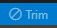

# AutoTrim

Trailing whitespace often exists after editing lines of code, deleting trailing words and so forth.  This VSCode extension tracks lines that have changed during the editing session and removes trailing tabs and spaces from them they no longer have an active cursor.

## Why Does It Matter?

The intent is to strike a balance between trimming lines vs churning diffs with unnecessary whitespace changes.  By only trimming trailing whitespace from lines that have already been edited in some other way, this extension can help reduce the chance of some avoidable bugs getting released into production.

There are 3 key reasons to avoid unnecessary whitespace changes:
- They can create unnecessary merge conflicts.  That represents work for someone, wastes time, and can feel annoying.
- Merge conflicts due to unnecessary whitespace changes can make it easy to overlook critical changes hidden within the sea of whitespace changes.  It's easy to assume the entire conflict is just whitespace changes and make an arbitrary decision how to resolve it, especially when feeling annoyed about it.  I've personally observed many instances where critical regressions were introduced by the combination of overly aggressive trimming of trailing whitespace and inattentive conflict resolution.
- Making unnecessary whitespace changes can create distracting diffs, interfere with per-line change annotations, and so on.

## How To Use It

Just install the extension and it will automatically track edited lines and trim trailing whitespace.

A clickable status bar item toggles the trimming mode between enabled or paused on a per-file basis.  It can be handy for those times when for whatever reason you need to preserve (or add!) trailing whitespace on edited lines.

 

There's a `autotrim.pauseFile` command in case you want to add a keybinding for toggling the trimming mode.

## Configuration

The `autotrim.debugMode` setting can be any of the following.

|Value |Description |
|---|---|
|0 | (_default_) Debugging mode is disabled. |
|1 | Debug logging is enabled. |
|2 | Debug logging is enabled, and the extension _does not alter file content_. |

## Credits

This extension is forked from [nathanridley.autotrim](https://github.com/axefrog/vscode-autotrim) v1.0.6, which trimmed trailing whitespace from any line the cursor visited.  The extension hadn't been updated in about 4 years, and I wanted to only trim trailing whitespace from lines _changed_ by the user.  Starting from the `vscode-autotrim` extension, I ended up mostly rewriting it, but the underlying data structures are still essentially the same.
